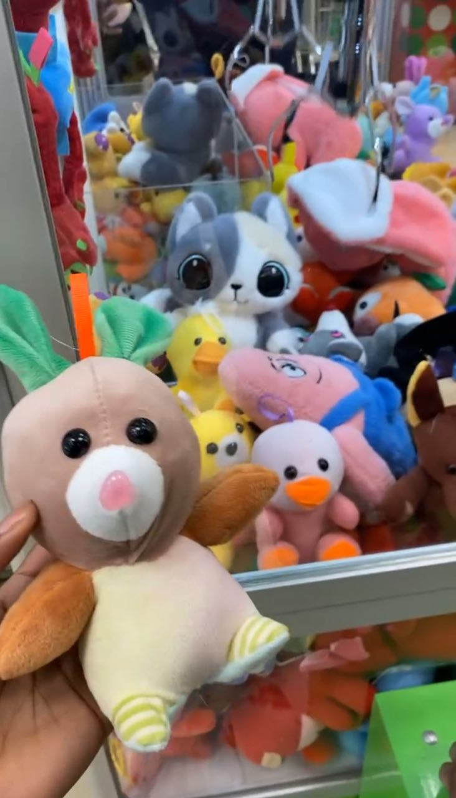

## How My Week Went 

This last week was really calm. I took a trip on a train to a nearby town to pay a visit to my bestfriend. The weather was soo good we literally walked around the whole city. Besides that i was very productive; practiced playing my recorder some more and I think i'm way better than when I just started. I'm also reading Dracula (I should have mentioned in my previous post) and it keeps getting better and better each day. I had way less fast food than I usually do and I reconnected with an old friend. I also won a doll from the claw machine, finally! but it's not that cute. Lol.

Here's something interesting, a few weeks back, my ex told me someone on snapchat was texting him and pretending to b me. I thought it was cap so i ignored him because he just wanted attention, but today morning I opened my facebook and came tothe realistaion that he was right! It's actually very scary and flattering at the same time. I reported the account and now i'm just waiting...

Thanks for reading. Catch you next week <3.
 
